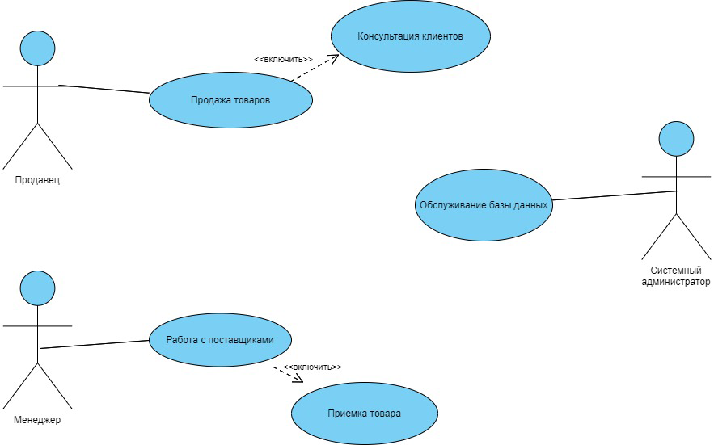
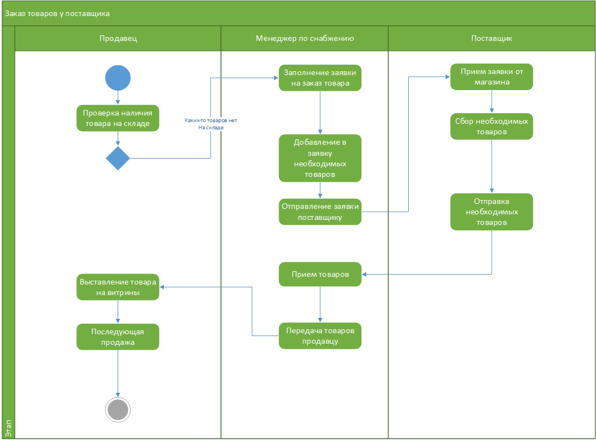
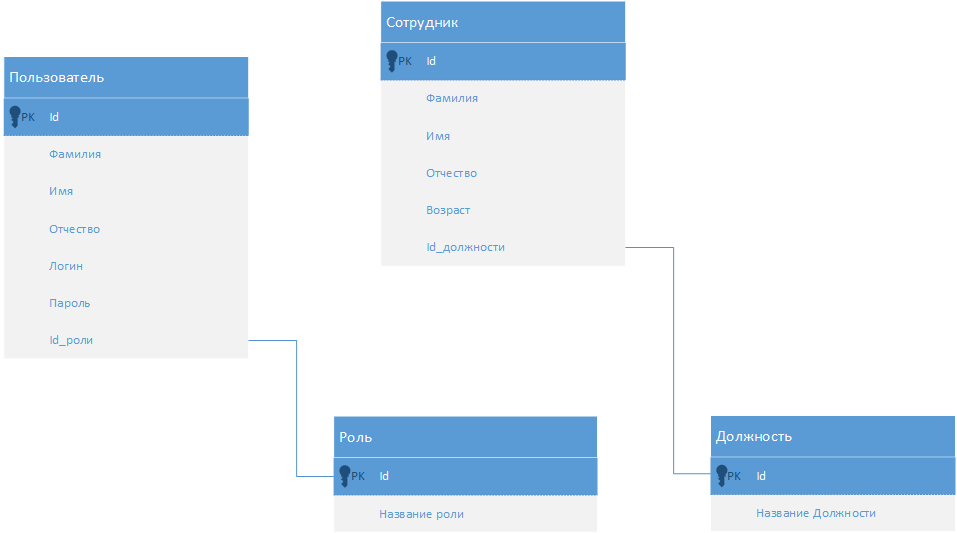
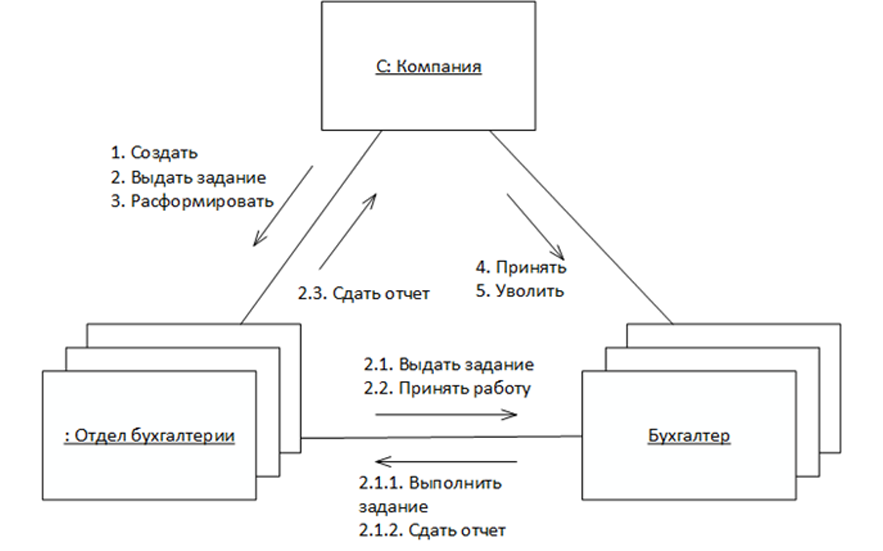
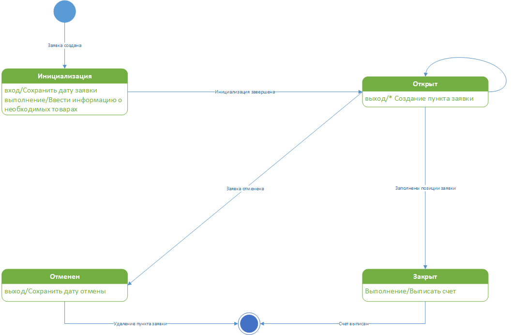

# SportStore-Cheatsheet

## Содержание
- [Git](#git)
- [SQL-Script](#sql-script)
- [Создание и настройка проекта](#создание-и-настройка-проекта)
- [MSSQL Management Studio](#mssql-management-studio)
- [Подготовка таблиц БД](#подготовка-таблиц-бд)
- [Создать окно авторизации](#создать-окно-авторизации)
- [Главное меню](#главное-меню)
- [Окно добавления/редактирования](#окно-добавленияредактирования)
- [Удаление](#удаление)
- [Создание библиотеки классов](#создание-библиотеки-классов)
- [Создание тестов на библиотеку](#создание-тестов-на-библиотеку)
- [Создание тест кейсов по шаблону](#создание-тест-кейсов-по-шаблону)
- [Примеры диаграмм](#примеры-диаграмм)

## Git
1. Создать репозиторий с .gitignore для VS, поменять main на master
2. Создать локальный репозиторий из папки решения
3. git init + git remote add origin <ссылка на удаленный репозиторий>
4. git config --local user.name "ФИО студента" + git config --local user.email "Группа студента@git.scc"
5. git pull origin master
6. git add .
7. git commit -m ""
8. git push origin master (-f)

## SQL-Script
- _Убрать префиксы из названий атрибутов_
- Первичный ключ сделать везде _Id_
- Атрибуты с датой - _date_, не datetime
- Изображение - не image, а _varchar(max)_

## Создание и настройка проекта
- Приложение WPF(Майкрософт)
- .NET 6.0

1. Добавить запрос в БД (Через обозреватель объектов SQL Server)
2. Через NuGet скачать Microsoft.EntityFrameworkCore, Microsoft.EntityFrameworkCore.Design, Microsoft.EntityFrameworkCoreSqlServer, Microsoft.EntityFrameworkCoreTools
3. Создать папку Resources для лого, иконки и заглушки, на каждой Ресурс + копировать более новую версию
4. В App.config
```
<?xml version="1.0" encoding="utf-8" ?>
<configuration>
	<connectionStrings>
        <add
			name="DefaultConnection"
			connectionString="Server=localhost,63027;Database=Inventarization;Trusted_Connection=True;"
			providerName="System.Data.SqlClient"/>
		<add
			name="ConnectionLocalDB"
			connectionString="Server=(localdb)\mssqllocaldb;Database=Inventarization;Trusted_Connection=True;"
			providerName="System.Data.SqlClient"/>
	</connectionStrings>
</configuration>
```
5. Создать папку Infrastructure
6. В NuGet консоли - `Scaffold-DbContext "Server=(localdb)\mssqllocaldb;Database=SportStore;Trusted_Connection=True;" Microsoft.EntityFrameworkCore.SqlServer -OutputDir Models`
7. В папке Models в Context файле заменить строку подключения на `optionsBuilder.UseSqlServer(ConfigurationManager.ConnectionStrings["ConnectionLocalDb"].ToString());`

## MSSQL Management Studio
1. Подключиться к (localdb)\MSSQLLocalDB
2. Создать ERD и сохранить в png
2. При ошибке - Свойства базы данных -> Файлы -> Владелец: sa 

## Подготовка таблиц БД
- В исходных файлах для импорта проверьте соответствие таблицам в базе данных. Все поля и последовательность полей в таблицах базы данных на сервере должны быть отражены в исходных данных. При необходимости отредактируйте исходные данные (добавление или удаление столбцов, редактирование данных в столбцах, перестановка столбцов, добавление столбцов для поля id).
- Чтобы разбить один столбец на несколько используется Мастер распределения текста по столбцам
- Иногда через VS нужно будет добавлять поля вручную
- Создать внешний ключ - FOREIGN KEY ([Поле в этой таблице]) REFERENCES [Родительская таблица] ([Id])
- Через MSSQL Management Studio ПКМ на БД => Задачи => Сформировать скрипты => схема и данные

## Создать окно авторизации 
- Не забыть про иконку и название окна
- В App.xaml изменить стиль в соответствии с требованиями по шаблону 
```
        <Style TargetType="Button">
            <Setter Property="Background" Value="#FF76E383" />
            <Setter Property="FontFamily" Value="Comic Sans MS"/>
            <Setter Property="FontSize" Value="10"/>
        </Style>

        <Style TargetType="ListBox">
            <Setter Property="Background" Value="#FF498C51" />
            <Setter Property="FontFamily" Value="Comic Sans MS"/>
            <Setter Property="FontSize" Value="10"/>
        </Style>

        <Style TargetType="TextBox">
            <Setter Property="FontFamily" Value="Comic Sans MS"/>
            <Setter Property="FontSize" Value="10"/>
        </Style>

        <Style TargetType="TextBlock">
            <Setter Property="FontFamily" Value="Comic Sans MS"/>
            <Setter Property="FontSize" Value="10"/>
        </Style>

        <Style TargetType="Window">
            <Setter Property="FontFamily" Value="Comic Sans MS"/>
            <Setter Property="FontSize" Value="10"/>
        </Style>
```

## Главное меню
Добавить сортировку, фильтрацию, поиск, количество, сброс

## Окно добавления/редактирования
- Проверить названия файлов изображений, их раскладку
- Сделать обновление списка при добавлении и редактировании

## Удаление
- Товар, который присутствует в заказе, удалить нельзя. Товар, у которого есть дополнительные товары, удаляется из базы данных вместе с информацией о дополнительных товарах, если ни один из товаров (даже дополнительный) не заказан.

### Создание таблицы дополнительных товаров RelatedProducts
- Создайте в папке Models новый класс RelatedProduct

```
namespace SportStore.Models
{
    public class RelatedProduct
    {
        public int Id { get; set; }
        public int ProductId { get; set; }
        public int RelatedProdutId { get; set; }
    }
}
```
- В классе SportStoreContext добавьте свойство для связи с базой данный:
`public virtual DbSet<RelatedProduct> RelatedProducts { get; set; }`
- Создайте в базе данных запрос на создание новой таблицы:
```
CREATE TABLE [dbo].[RelatedProducts] (
    [Id]              INT IDENTITY (1, 1) NOT NULL,
    [ProductId]       INT NOT NULL,
    [RelatedProdutId] INT NOT NULL,
    CONSTRAINT [PK_RelatedProducts] PRIMARY KEY CLUSTERED ([Id] ASC),
    CONSTRAINT [FK__RelatedProducts__ProductId__571DF1D5] FOREIGN KEY ([ProductId]) REFERENCES [dbo].[Product] ([Id]) ON DELETE CASCADE,
    CONSTRAINT [FK__RelatedProducts__RelatedProdutId__571DF1D5] FOREIGN KEY ([RelatedProdutId]) REFERENCES [dbo].[Product] ([Id])
);
```

- Показать кнопки Добавить/Удалить только если пользователь имеет роль администратора

## Создание библиотеки классов
- В VS в этом же решении добавить проект
- Библиотека классов (Майкрософт)
- .NET 6.0

## Создание тестов на библиотеку
- В VS в этом же решении добавить проект
- Тестовый проект (NUnit)
- .NET 6.0
- В зависимостях добавить ссылку на проект 
- Запуск тестов - `dotnet test`

## Создание тест кейсов по шаблону

## Примеры диаграмм
Вариантов использования (UseCase)

Деятельности

Классов

Кооперации

Состояний
